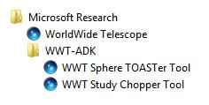

# This Repository Has Been Superseded

Its content has been moved to the [Data Guide][dg].

[dg]: https://github.com/WorldWideTelescope/worldwide-telescope-data-guide/

## WorldWide Telescope Data Tools Guide

This document describes the use of a number of tools that can be used to help prepare data for the WorldWide Telescope.

To install the tools, follow the instructions for installing the [WorldWide Telescope May 2009 ADK](http://research.microsoft.com/en-us/collaboration/wwt-ap/resources.aspx). To run the tools select **All Programs** and navigate to the following location:

Ensure that you are using the latest versions of the tools: currently versions 0.23.
